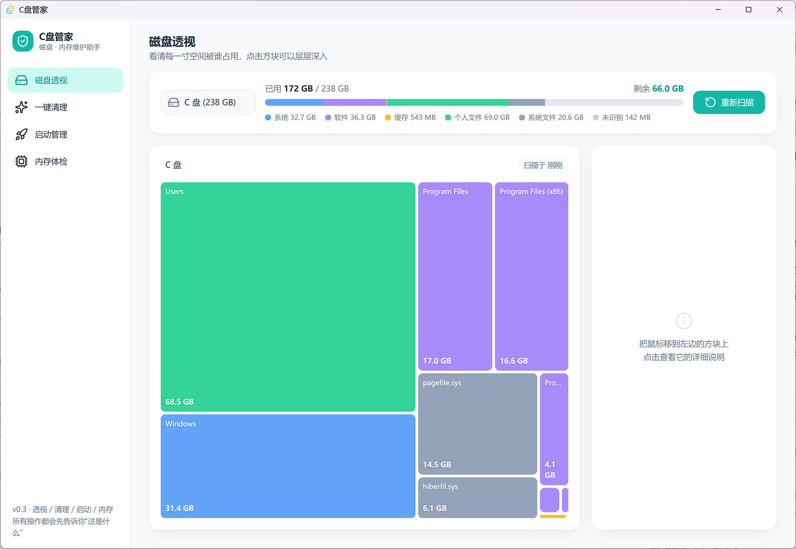
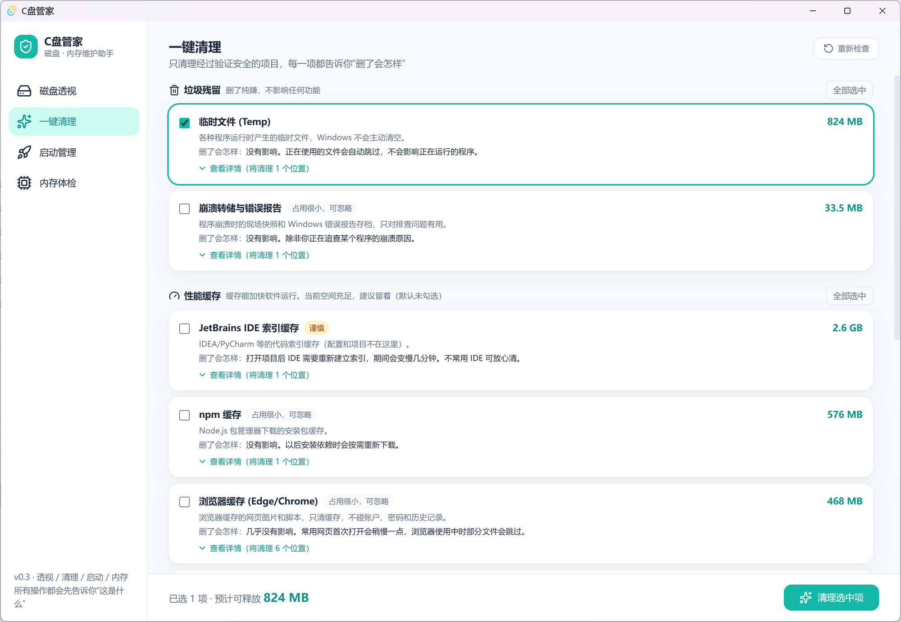
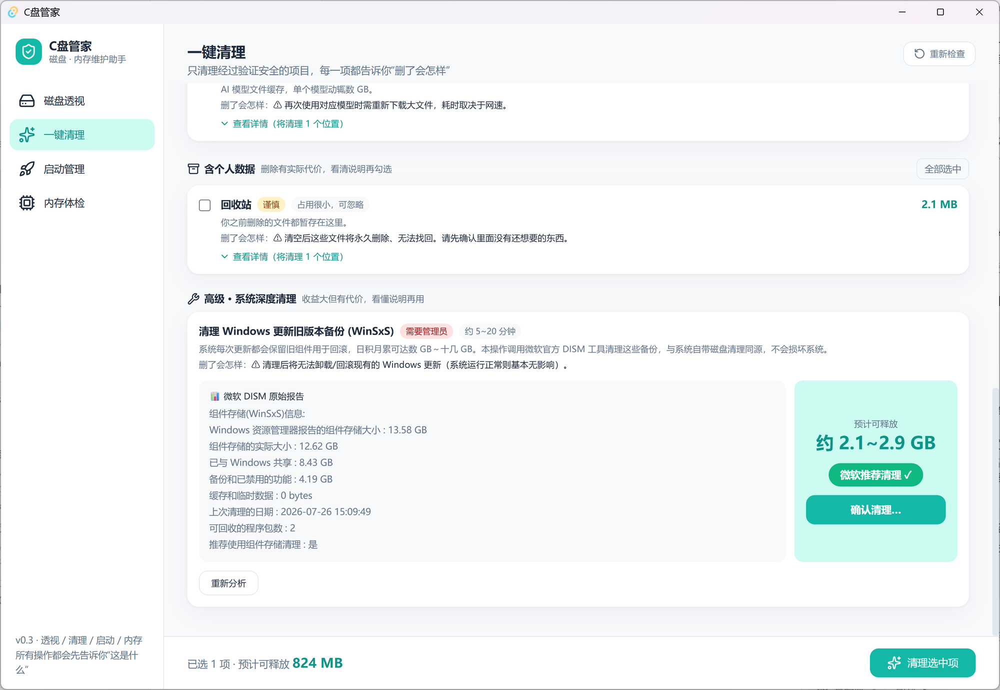
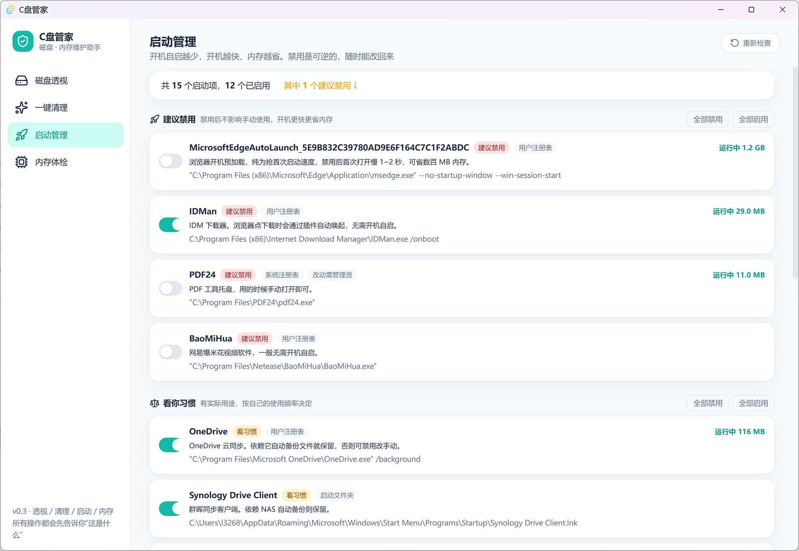
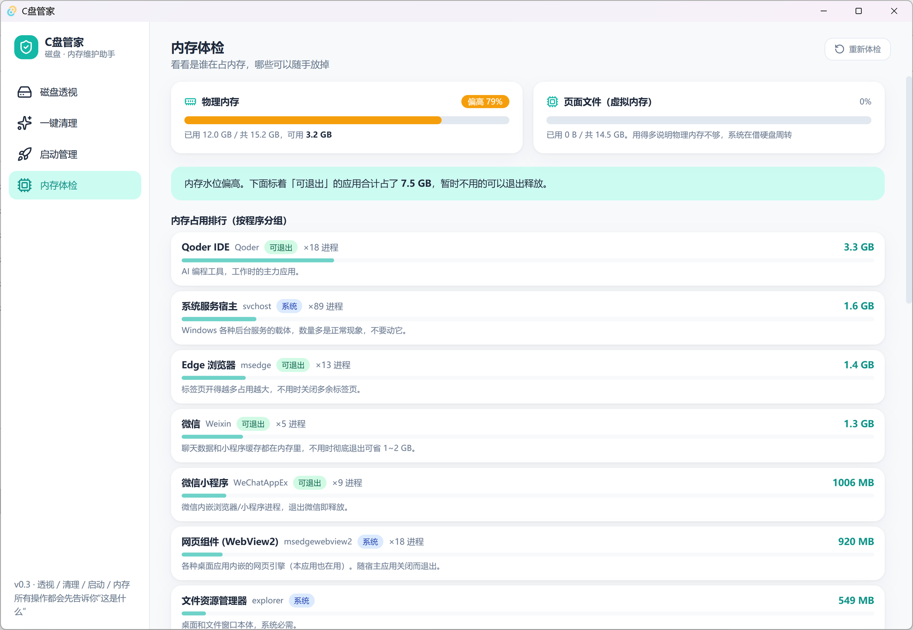

<div align="center">

# 🛡️ C盘管家

**给普通人的 Windows 磁盘与内存维护助手**

看得懂 · 敢放心 · 零负担

[](https://github.com/YGTQ3/disk-butler/releases)
[](#-许可)


[📥 下载最新版](https://github.com/YGTQ3/disk-butler/releases) · [功能一览](#-四大功能) · [它凭什么让你放心](#-它凭什么让你放心)

</div>

---

## 为什么做这个？

C 盘又红了。你打开某款"清理大师"，它尖叫着**"发现 3247 个垃圾！你的电脑危在旦夕！"**——然后趁你慌乱，装上三个全家桶。

你去问懂电脑的朋友，他甩来 WizTree 和一句"自己看"。满屏英文路径，你不知道 `WinSxS` 是干嘛的，更不敢删。

**C盘管家选择第三条路：把你当成年人。**

不吓唬、不装弟弟、不留后门。每一项操作都先回答三个问题：**这是什么？为什么占空间？删了会怎样？** 看明白了，你自己做决定。

## 💎 它凭什么让你放心

| | C盘管家 | 某些"清理大师" |
|---|---|---|
| 安装包体积 | **2.4 MB**（Rust + Tauri 原生，无 Electron 包袱） | 100~300 MB |
| 联网行为 | **零网络请求**——不上传、不统计、不检查更新 | 云端"分析"你的文件 |
| 广告 / 弹窗 | **没有，永远没有** | 右下角惊喜不断 |
| 后台驻留 | **一个只读扫描服务**（同 Everything 模式）：让主程序免管理员权限秒级扫盘，不联网、不写盘、可在服务管理器随时禁用（禁用后自动回退慢速扫描） | 三个常驻服务互相拉起 |
| 删除逻辑 | **白名单后端强制**——界面显示什么就删什么，想越界删都做不到 | "智能"扫描，删了什么天知道 |
| 代码 | **全部开源**，每一行都可审计 | 黑箱 |

> 🦀 **为什么是 Rust？** 核心引擎用 Rust 编写——内存安全由编译器保证（没有缓冲区溢出这类漏洞温床），并行扫描全盘只要十几秒，而运行内存占用只有传统 Electron 工具的零头。安全和轻快，不必二选一。

## ✨ 四大功能

### 🗺️ 磁盘透视 —— 看清每一寸空间被谁占用

磁盘占用画成彩色拼图：大块头一眼可见，点击色块层层深入。**秒级扫描**——直读 NTFS 主文件表（MFT，WizTree 同款原理），全盘统计不再需要逐个目录遍历。色彩即语义——🔵 系统 / 🟣 软件 / 🟠 缓存 / 🟢 个人文件，配合 **60+ 条中文软件生态知识库**（剪映、微信、百度网盘、npm、conda……），每个目录都用人话告诉你“这是什么、能不能动”。扫描结果本地留存，下次打开秒显上次结果。



### 🧹 一键清理 —— 三层策略，只清该清的

清理项分三组，各有各的规矩：

- 🗑️ **垃圾残留**（临时文件、更新包残留）：删了纯赚，默认勾选；
- ⚡ **性能缓存**（npm、浏览器、IDE 索引）：缓存能加快软件运行——**空间充足时我们会劝你留着**，这是别的清理软件不会说的实话；
- 📦 **含个人数据**（回收站、下载断点）：永不默认勾选，看清说明再动手。

每一项都能展开"查看详情"，**将被清理的每个具体路径**白纸黑字列出来——界面显示的，就是实际执行的。



### 🔧 系统深度清理 —— 先分析，后动手

Windows 更新旧版本备份（WinSxS）动辄十几 GB。高级区调用**微软官方 DISM 工具**分两步走：第一步只读分析，左边原始报告一字不改，右边大字告诉你能清多少、微软是否推荐；第二步你确认了才真正执行。全程与系统自带磁盘清理同源，不碰任何第三方黑科技。



### 🚀 启动管理 + 🧠 内存体检

开机自启越少，开机越快、内存越省。每个自启项标注真实路径、当前内存占用和"建议禁用 / 看你习惯 / 建议保留"分组建议，开关可逆、随时改回。内存体检把占用大户按程序分组排行，标出哪些"可退出"，谁在吃内存一目了然。

| 启动管理 | 内存体检 |
|---|---|
|  |  |

## 📥 下载安装

前往 [Releases](https://github.com/YGTQ3/disk-butler/releases) 下载最新的 `DiskButler_x.x.x_x64-setup.exe`，双击安装，2.4 MB 转瞬装完。

- 系统要求：Windows 10/11 x64（WebView2 系统自带，无需额外运行库）
- 首次运行如遇 SmartScreen 提示"未知发布者"：点击"更多信息 → 仍要运行"（个人开源项目暂无代码签名证书，源码就在这里，可自行审计或构建）

## 🔨 从源码构建

```bash
# 环境要求：Node.js 18+、Rust (MSVC 工具链)、VS Build Tools 2022 (C++ 工作负载)
git clone https://github.com/YGTQ3/disk-butler.git
cd disk-butler
npm install

# 开发模式
npm run tauri dev
# 可选：想在开发模式体验秒级扫描，先 `npm run build:svc`，
# 再用管理员终端运行 `src-tauri\target\release\disk-butler-svc.exe run-console`；
# 不运行则自动回退慢速扫描

# 打包安装程序（16GB 内存机器建议限制并行度）
set CARGO_BUILD_JOBS=2 && npm run tauri build
```

> 💡 如遇 `LLVM ERROR: out of memory`：`Cargo.toml` 已为 `windows` 系巨型绑定 crate 单独降级 `opt-level = 1`（纯 API 壳，性能零损失），并用 `CARGO_BUILD_JOBS=1/2` 限制并行；同时确认系统页面文件充足。

## 🧱 技术栈

| 层 | 技术 |
|---|---|
| 桌面框架 | Tauri 2（Rust 后端 + 系统 WebView2，安装包 2.4 MB） |
| 扫描引擎 | NTFS MFT 直读（[ntfs-reader](https://github.com/kikijiki/ntfs-reader)，秒级全盘）+ 后台只读扫描服务（命名管道 IPC），jwalk 并行遍历兜底 |
| 系统能力 | DISM 组件清理 / 注册表启动项 / 回收站 Shell API / sysinfo 内存采样 |
| 前端 | React 18 + TypeScript + Vite + Tailwind CSS v4 |
| 可视化 | d3-hierarchy squarify 布局 + React 自绘 + framer-motion 动效 |
| 设计体系 | 全令牌化（tokens.css），设计决策见 [DESIGN.md](./DESIGN.md) |

## 📜 设计原则

1. **用户知情权优先**：每个操作都讲清作用对象、原理、影响与恢复方式，禁止恐吓式文案；
2. **保守安全**：白名单后端强制、含个人数据项永不默认勾、使用中文件自动跳过、高危操作两步式确认；
3. **数据诚实**：界面上每个数字都标注来源——"扫描于 5 分钟前"就是 5 分钟前，绝不装实时；
4. **隐私即默认**：一切分析在你的电脑本地完成，唯一保存的数据是你自己的扫描结果（也在本地）；
5. **说人话**：`1.5 GB` 而不是 `1610612736 字节`。

## 🗺️ 路线图

- [x] 内存体检：页面文件配置与实际启用不一致时预警（v0.5.0）
- [ ] AI 分析报告：基于目录元数据（不读文件内容）生成个性化清理建议
- [ ] GitHub Actions 自动构建发版

## 🤝 帮它认识更多软件

清理规则靠真实机器的样本积累。花 1 分钟跑一下
[规则采集器](./tools/README.md)（不删东西、不联网、报告可逐行审查），
把报告发给我们，你电脑上那些小众软件的缓存就能被下一个版本安全地识别。

## 📄 许可

MIT License

---

<div align="center">

*这个项目源自一次真实的 C 盘救援：从剩余 46 GB 清出 80+ GB 之后，*
*我们把整套分析经验和安全边界，做成了这个 2.4 MB 的小工具。*

**如果它帮到了你，点个 ⭐ 就是最好的支持。**

</div>
